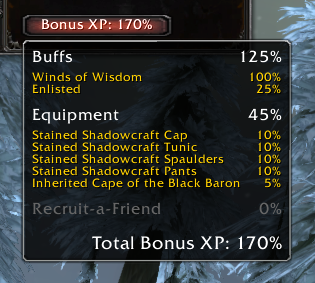
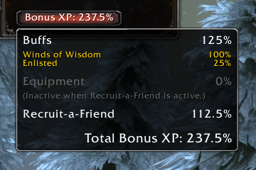
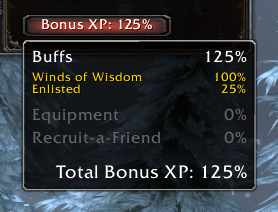

# Bonus XP Add-On 

How much Bonus XP are you earning? Do you have Heirloom gear? Are you using Recruit-a-Friend? Is there a Bonus XP event taking place?

Now you'll know!

Open the Character screen (C) and find your Bonus XP percentage at the bottom of the Character Stats pane. Hover over to see the buffs and equipment are contributing to your bonus.

## Thanks
Thanks to the folks who help test:

* [Kezri](https://worldofwarcraft.com/en-us/character/us/silver-hand/Kezri)
* [Lithiana](https://worldofwarcraft.com/en-us/character/us/silver-hand/lithiana/)
* [Keyaenlord](https://worldofwarcraft.com/en-us/character/us/silver-hand/Keyaenlord)

## Credits
This add-on is based on [evilWizard's XP Bonus Counter](https://www.curseforge.com/wow/addons/xp-bonus-counter). The calcuations used to determine bonus XP are quite tricky, so a huge thanks to evilWizard for their work.
